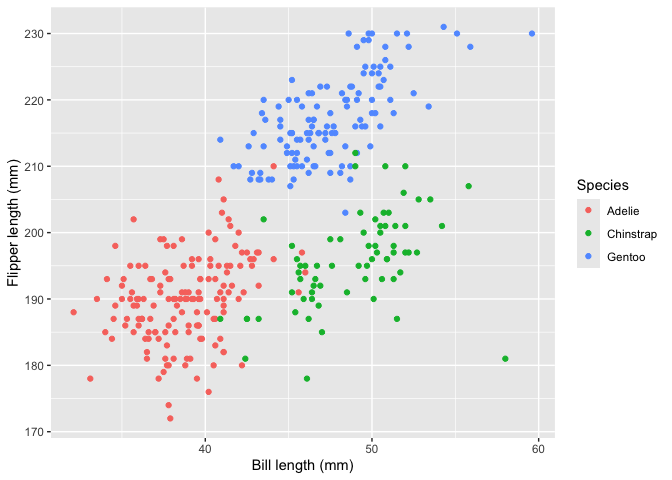

Homework 1
================
Bowen Yao

``` r
library(ggplot2)
library(tidyverse)
```

    ## ── Attaching core tidyverse packages ──────────────────────── tidyverse 2.0.0 ──
    ## ✔ dplyr     1.2.1     ✔ readr     2.2.0
    ## ✔ forcats   1.0.1     ✔ stringr   1.6.0
    ## ✔ lubridate 1.9.5     ✔ tibble    3.3.1
    ## ✔ purrr     1.2.2     ✔ tidyr     1.3.2
    ## ── Conflicts ────────────────────────────────────────── tidyverse_conflicts() ──
    ## ✖ dplyr::filter() masks stats::filter()
    ## ✖ dplyr::lag()    masks stats::lag()
    ## ℹ Use the conflicted package (<http://conflicted.r-lib.org/>) to force all conflicts to become errors

\##Problem 1

``` r
data("penguins", package = "palmerpenguins")
```

The dataset contains measurements of 344 penguins of Adelie, Chinstrap,
Gentoo species; Variables include species, island, bill length, bill
depth, flipper length, body mass, sex, and year. Mean bill length is
43.92mm, mean bill depth is 17.15mm, with mean body mass of 4201.75g.
The dataset has 344 rows and 8 columns. The mean flipper length is
200.92 mm.

``` r
penguin_plot = ggplot(
  penguins,
  aes(
    x = bill_length_mm,
    y = flipper_length_mm,
    color = species
  )
) +
  geom_point(na.rm = TRUE) +
  labs(
    x = "Bill length (mm)",
    y = "Flipper length (mm)",
    color = "Species"
  )

penguin_plot
```

<!-- -->

``` r
ggsave(
  filename = "penguin_scatterplot.png",
  plot = penguin_plot)
```

    ## Saving 7 x 5 in image

\##Problem 2

``` r
example_df = tibble(
  normal_sample = rnorm(10),
  is_positive = normal_sample > 0,
  character_values = c("a", "b", "c", "d", "e", "f", "g", "h", "i", "j"),
  factor_values = factor(c(
    "low", "medium", "high", "low", "medium",
    "high", "low", "medium", "high", "low"
  ))
)
```

``` r
mean(pull(example_df, normal_sample))
```

    ## [1] -0.4322633

``` r
mean(pull(example_df, is_positive))
```

    ## [1] 0.3

``` r
mean(pull(example_df, character_values))
```

    ## Warning in mean.default(pull(example_df, character_values)): argument is not
    ## numeric or logical: returning NA

    ## [1] NA

``` r
mean(pull(example_df, factor_values))
```

    ## Warning in mean.default(pull(example_df, factor_values)): argument is not
    ## numeric or logical: returning NA

    ## [1] NA

The mean works for numeric values, the mean works for logical values
because it treated TRUE and FALSE as 1 and 0 so 0.4 is the proportion of
values greater than o, the mean dooes not work for charactor and factor
because mean() does not accept these types.

``` r
as.numeric(pull(example_df, is_positive))
as.numeric(pull(example_df, character_values))
as.numeric(pull(example_df, factor_values))
```

Logical value onverts TRUE to 1 and FALSE to 0, explaining why its mean
works. Character value become NA because they do not represent numbers.
Factor value converts to their integer codes. These codes represent
category labels, so meaningless if taken average of.
